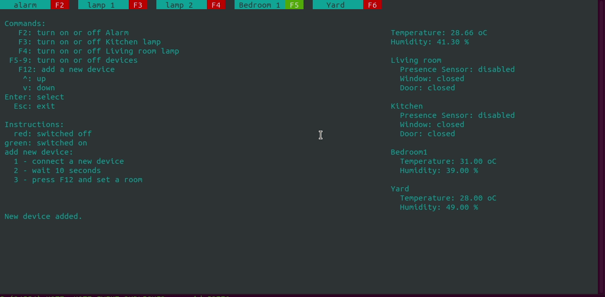

# Embarcados - Trabalho Final

**Disciplina**: Fundamentos de Sistemas Embarcados (UnB) - Professor Renato Coral. 
**Tópicos**: automação residencial, mqtt, GPIO, esp32, Raspberry. 

## Sobre o Trabalho Final

O trabalho tem por objetivo a criação de um sistema distribuído de automação residencial através de uma placa Raspberry Pi 4 (servidor central) e controladores distribuídos com placas ESP32 (servidores distribuídos), interconectados via Wifi através do protocolo MQTT.

Maiores informações e requisitos do trabalho disponíveis em:
*   [Gitlab - FSE - Projeto Final](https://gitlab.com/fse_fga/projetos/trabalho-final).

## Demonstração do Projeto

## Execução do Projeto

Para executar o projeto, faça o clone do repositório e, na pasta principal, proceda com as instruções:

*   Primeiro, entre na pasta `programa/servidor_central` e proceda com os comandos:
    *   Compilar: `make`;
    *   Abrir em tela cheia: `F11`; e
    *   Executar: `bin/bin`.
*   Agora, em outro terminal, entre na pasta `programa/cliente` e execute:
    *   Limpe a memória flash da esp32: `idf.py -p PORTA erase_flash`;
    *   Faça o build da aplicação: `idf.py build`;
    *   Inicie a esp32: ` idf.py -p PORTA flash monitor`.

*   Logs da execução do programa são salvos em `programa/servidor_central_dat`.

Observações:

*   **Executar o servidor central primeiro**;
*   **Caso o servidor venha a cair, será necessário reiniciar e apagar as memórias das esps**.

## Instruções de Uso

O menu é seccionado em três grandes regiões: menu superior de opções; instruções de uso (esquerda) e informações sobre o sistema e as esps (direita).

Opções do programa:

*   **F2**: controle ON/OFF do alarme;
*   **F3**: controle ON/OFF da lâmpada da cozinha;
*   **F4**: controle ON/OFF da lâmpada da sala de estar;
*   **F5 até F9**: controle ON/OFF do dispositivo (esp) conectado;
*   **F12**: adicionar um novo dispositivo;

Teclas de navegação: seta para cima, seta para baixo, **ENTER** (selecionar) e **ESC** (sair).

**Inicialize um novo dispositivo (esp), aguarde um pouco e conecte-o ao servidor central através da opção F12.**

## Autor

|Matrícula | Estudante |
| -- | -- |
| 17/0039251 | Lieverton Santos Silva |
| 17/0024121  |  Welison Lucas Almeida Regis |

## Referências

*   [Descrição do Trabalho Final](https://gitlab.com/fse_fga/projetos/trabalho-final)
