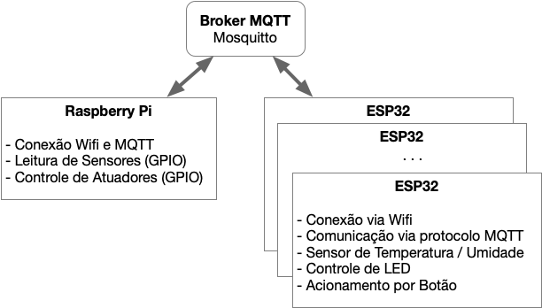

# Trabalho Final 2020/1

Este é o trabalho final da disciplina de Fundamentos de Sistemas Embarcados (2020/1). O trabalho final pode ser feito em duplas ou de modo individual.

## 1. Objetivos

O objetivo deste trabalho é criar um sistema distribuído de automação residencial utilizando como sistema computacional central uma placa Raspberry Pi 4 e como controladores distribuídos placas ESP32, interconectados via Wifi através do protocolo MQTT.

## 2. Componentes do Sistema

O sistema do Servidor Central será composto por:
1. 01 Placa Raspberry Pi 4;
2. 01 Sensor BME280 (I2C) para a medição da temperatura / umidade;
3. Circuito de potência com 2 relés para acionametno de Lâmpadas;
4. 02 sensores de presença;
5. 04 sensores de portas / janelas;
6. Saída de Som para Alarme.

Clientes distribuídos:
1. Dev Kit ESP32;
2. Sensor de Temperatura e Umidade DHT11;
3. Botão (Presente na placa);
4. LED (Presente na Placa).

Broker MQTT (Mosquitto - Núvem)

## 3. Conexões entre os módulos do sistema

1. O servidor Central (Raspberry Pi) bem como seus clientes (ESP32) deverão se conectar via Rede Ethernet/Wifi através do protocolo MQTT por meio do Broker Mosquitto;
2. Todas as mensagens via MQTT devem estar no formato JSON;
3. **ESP32**: o botão e o LED de serem usados são os dispositivos já integrados no próprio kit de desenvolimento (Botão = GPIO 0 / LED = GPIO 2);
4. **ESP32**: o sensor de temperatura da ESP será o DHT11 (Ligado à GPIO 4);
5. **Servidor Central**: o alarme do deverá ser acionado tocando um arquivo de áudio pela saída de som da própria placa (Uma opção é o uso do omxplayer - https://www.raspberrypi.org/documentation/usage/audio/);
6. **Servidor Central**: o sensor de temperatura BME280 está ligado ao barramento I2C do servidor distribuído e utiliza o endereço (0x76);
7. **Servidor Central**: as lâmpadas, sensores de presença, de portas e janelas estão ligados aos pinos da GPIO conforme a Tabela 1.

| Item                                 | GPIO |
|--------------------------------------|:----:|
| Lâmpada 01 (Cozinha)                 |  17  |
| Lâmpada 02 (Sala)                    |  18  |
| Sensor de Presença 01 (Sala)         |  25  |
| Sensor de Presença 02 (Cozinha)      |  26  |
| Sensor Abertura 01 (Porta Cozinha)   |  05  |
| Sensor Abertura 02 (Janela Cozinha)  |  06  |
| Sensor Abertura 03 (Porta Sala)      |  12  |
| Sensor Abertura 04 (Janela Sala)     |  16  |

## 4. Requisitos

Os sistema de controle possui os seguintes requisitos.

#### **Servidor Central**:
1. O código do Servidor Central pode ser desenvolvido em Python, C ou C++;
2. Prover uma interface que mantenha o usuário atualizado sobre o estado de cada dispositivo (atualizado a cada 1 segundo), incluindo a temperatura e umidade de cada cômodo;
3. Prover mecanismo para que o usuário possa acionar manualmente todos os dispositivos controláveis (lâmpadas, aparelhos de ar-condicionado, etc.)
4. Prover mecanismo para ligar e desligar o sistema de alarma que, quando ligado, deve tocar um som de alerta ao detectar presenças ou abertura de portas/janelas;
5. Prover suporte para adicionar novos clientes ESP (até 5 clientes) cujas funções do botão e led representarão entradas (sensores de presença/porta/janelas ou interruptores) e saídas (acionamento de lâmpadas, tomadas, etc). Cada entrada/saída deve ser nomeada pelo usuário no momento da adição do dispositivo ESP.\
A adição de um novo dispositivo será realizada assim que a ESP se conectar à rede Wifi e enviar uma mensagem inicial de configuração para o tópico fse2020/\<**matricula**\>/dispositivos/\<**ID_do_dispositivo**\>. Neste caso, na tela do Servidor Central deve aparecer o novo dispositivo a ser adicionado onde, através de um comando, deverá ser possível definir:
    1. O cômodo da casa onde o dispositivo estará alocado e que irá definir o nome do tópico onde o mesmo irá publicar suas mensagens (Obs: o nome do tópico não pode conter espaços ou caracteres especiais - preferencialmente manter somente com letras sem acentos e números);
    2. O nome do dispositivo de Entrada e Saída sendo controlados por ele; 
    3. Ao final da configuração, sede ser enviada uma mensagem à ESP informando o nome do tópico/cômodo ao qual ela deverá, a partir deste momento enviar a mensagem com o estado dos dispositivos que controla;
6. Manter log (Em arqvuio CSV) dos comandos acionados pelos usuários e do acionamento dos alarmes;

Obs. 1: A Matrícula a ser utilizada será a de um dos alunos da dupla de trabalho; 2: O ID_do_dispositivo deve ser o MAC_ADRESS da ESP.

#### **Cliente ESP32**:

1. O código da ESP32 deve ser desenvolvido em C utilizando o framework ESP-IDF;
2. A ESP32 deverá se conectar via Wifi (com as credenciais sendo definidas em variável de ambiente pelo Menuconfig);
3. O cliente deve, ao iniciar pela primeira vez, deve:  
    3.1 Enviar uma mensagem MQTT de inicialização para o tópico fse2020/\<**matricula**\>/dispositivos/\<**ID_do_dispositivo**\> e se inscrever no mesmo tópico. Esse será o canal de comunicação de retorno do servidor central.   
    3.2 Em seguida, o servidor central irá enviar uma mensagem de retorno (JSON) informando o nome do cômodo ao qual o dispositivo foi associado (que será o nome do tópico ao qual o mesmo irá publicar as informações sobre o estado de seus sensores). O formato deste tópico será: fse2020/\<**matricula**\>/<**comodo**\>.  
    A partir deste momento, cada mudança de estado nos dispositivos controlados pela ESP deve ser publicado nos seguintes tópicos:
    fse2020/\<**matricula**\>/<**comodo**\>/temperatura  
    fse2020/\<**matricula**\>/<**comodo**\>/umidade
    fse2020/\<**matricula**\>/<**comodo**\>/estado

4. Caso a ESP já tenho sido cadastrada no servidor central, deve guardar esta informação em sua memória não volátil (NVS) e, caso seja reiniciada, deve manter o estado anterior e não precisar se cadastrar novamente.
5. Realizar a leitura da temperatura e umidade à partir do sensor DHT11 e enviar seu valor para o servidor central a cada 30 segundos;
6. Monitorar o botão utilizando interrupções e enviar por mensagem push a cada mudança do estado do botão;
7. Acionar o LED (Saída) à partir dos comandos enviados pelo servidor central pelo canal;

## 5. Critérios de Avaliação

A avaliação será realizada seguindo os seguintes critérios:

|   ITEM    |   DETALHE  |   VALOR   |
|-----------|------------|:---------:|
|**Servidor Central**    |       |       |
|**Interface (Estado)**  |   Interface (linha de comando) apresentando o estado de cada dispositivo, temperaturas e umidades.  |   1,0   |
|**Interface (Acionamento)** |   Mecanismo para acionamento de dispositivos. |   0,5   |
|**Acionamento do Alarme**   |   Mecanismo de ligar/desligar alarme e acionamento do alarme de acordo com o estado dos sensores. |   0,5   |
|**Log (CSV)**   |   Geração de Log em arquivo CSV.  |   0,5 |
|**Clientes ESP32**    |       |       |
|**Leitura de Temperatura / Umidade**    |   Leitura e envio dos valores de temperatura / umidade a cada 1 segundo.  |   1,0   |
|**Acionamento de Dispositivos** |   Correto acionamento e envio do estado da saídade acordo com os comandos do servidor Central.    |   0,5   |
|**Acionamento da Entrada** | Correta detecção e envio do estado da entrada ao servidor central.   |   0,5  |
|**Geral**    |       |       |
|**Comunicação MQTT**  |   Correta implementação de comunicação entre os dispositivos. |   2,0   |
|**Mecanismo de Cadastramento de Clinetes ESP32**   |   Correta implementação do mecanismo de adição de clientes ESP32 tanto no servidor quanto a configuração do Cliente.  |   2,0 |
|**Qualidade do Código** |   Utilização de boas práticas como o uso de bons nomes, modularização e organização em geral. |   1,5 |
|**Pontuação Extra 1** |   Qualidade e usabilidade acima da média. |   0,5   |
|**Pontuação Extra 2** |   Suporte o modo Low Power da ESP32. |   0,5   |
|**Pontuação Extra 3** |   Suporte à OTA na ESP32. |   0,5   |

## 6. Referências

[Driver da Bosh para o sensor BME280](https://github.com/BoschSensortec/BME280_driver)

[Biblioteca DHT11 para ESP-IDF ESP32](https://github.com/0nism/esp32-DHT11)

[Biblioteca BCM2835 - GPIO](http://www.airspayce.com/mikem/bcm2835/)

[Eclipse Mosquitto - Broker MQTT](https://mosquitto.org/)
